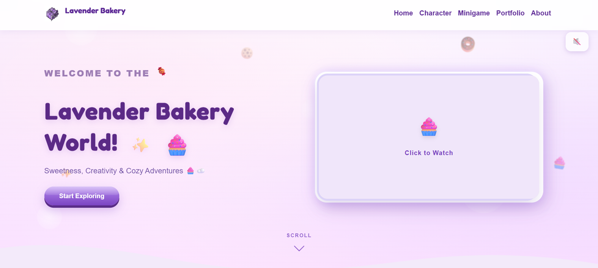
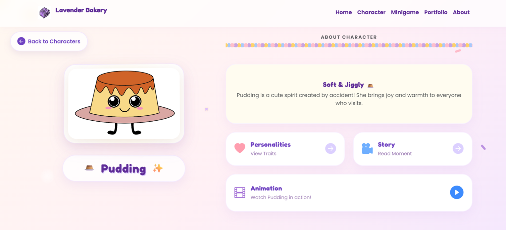
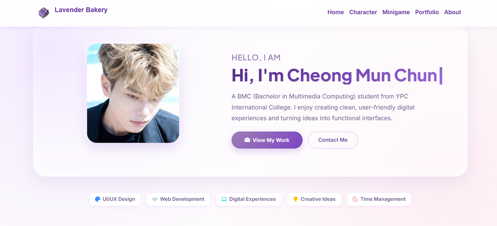
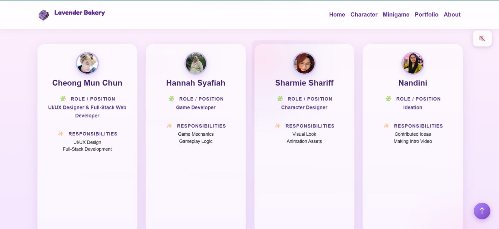

Note: This project was developed as part of a university coursework. To meet coursework deadlines, CSS and JavaScript were embedded within individual HTML pages. Future improvements include refactoring the project into a modular structure with separated CSS and JavaScript files.

# 🥐 Lavender Bakery Interactive Website

An interactive bakery website developed as a university team project. The website showcases bakery products through a modern, responsive and user-friendly interface while enhancing customer engagement using interactive design elements.

This project demonstrates my abilities in UI/UX design, front-end development, database integration and responsive web development using Bootstrap.

---

## 🚀 Technologies

- HTML5
- CSS3
- Bootstrap 5
- PHP
- MySQL
- Figma
- XAMPP

---

## 👨‍💻 My Role

**Team Leader**

**Full-stack Web Developer**

**UI/UX Designer**

Due to uneven task distribution within the team, I was responsible for the majority of the project development, including system design, implementation, testing and presentation.

---

## ✨ Key Features

### 🌐 Website

- Responsive Design
- Interactive Navigation
- Character Showcase
- Product Portfolio
- About Us Page
- Portfolio Section
- Contact Section

### 🎨 UI / UX

- Modern Interface Design
- Bootstrap Responsive Layout
- Interactive Components
- Mobile Friendly
- Consistent User Experience

### 💻 System

- PHP Integration
- MySQL Database
- Dynamic Web Pages
- Reusable Components

---

## 💼 My Responsibilities

- Team Leadership
- UI Design
- UX Design
- Front-end Development
- Bootstrap Development
- PHP Development
- MySQL Database Integration
- Responsive Web Design
- Testing & Debugging
- Documentation
- Final Presentation

---

## 📸 Screenshots

### 🏠 Home Page

---

### 🧁 Character Page

---

### 💼 Portfolio

---

### 📖 About Us

---

### 📱 Responsive Layout

---

## 📚 Learning Outcomes

This project strengthened my skills in:

- Responsive Web Design
- Bootstrap 5
- UI / UX Design
- Team Leadership
- Requirement Analysis
- PHP Development
- MySQL Integration
- Database Design
- Problem Solving
- Software Testing

---

## 🚀 Future Improvements

- Online Ordering System
- Customer Login
- Shopping Cart
- Product Search
- Admin Dashboard
- Payment Gateway
- CMS Integration

---

## 👨‍🎓 Author

**Cheong Mun Chun**

Bachelor of Science (Hons) Multimedia Computing

Liverpool John Moores University (LJMU)

Currently seeking a **Front-end Developer Internship**.
